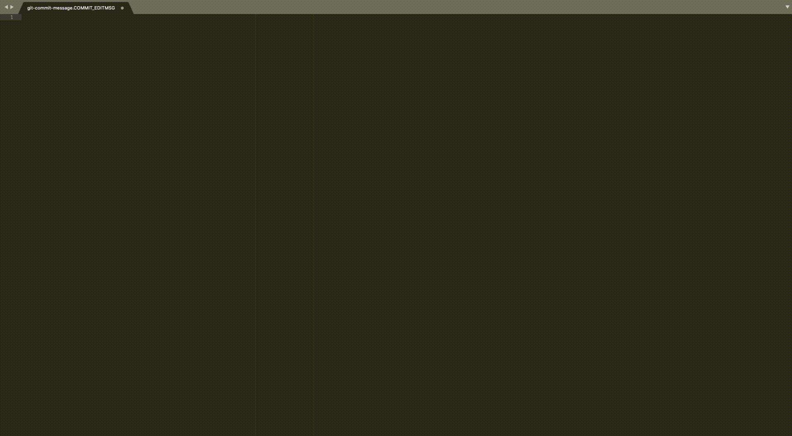

# Sublime-git-co-author

Co-authorship message template for Git commit messages.

# In Action




# Configuration Options

The configuration is set up as such:

```es6
{
    /**
     * Default set of prompts that can trigger the auto-completion
     */
    "prompts": [
        "co",
        "coau",
        "coauthor",
        "co-author",
        "friend"
    ],
    /**
     * The default domain to use in the co-authorship. This is useful when
     * working in an organisation where everyone has a shared domain. For
     * example, if you work at Dabs Org, your domain may be dabs.org. By
     * setting the default_domain to dabs.org the provided auto-complete would
     * in that case be:
     *
     * Co-authored-by: ${1:name} <${2:email}@dabs.org>
     *
     * This means that you will only have to provide the name and email values
     */
    "default_domain": "",
    /**
     * The set of scopes for which this plugin will be available
     */
    "relevant_scopes": [
        "text.git.commit",
        "text.git-commit"
    ]
}
```
